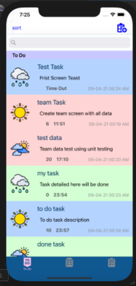

# ToDoList
Simple IOS App using objective-c to Manage Your Todo

## Feature
* Application Design.
* Sort Todos according to Priority.
* Show Todo Details.
* Edit Todo.
* store Todos using UserDefualts.
* Reminder.

## ScreenShots :
()
